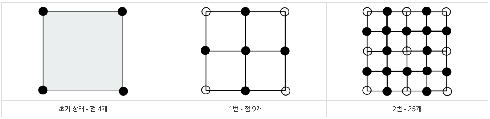

[2903 중앙 이동 알고리즘](https://www.acmicpc.net/problem/2903)  
===========
### 문제  

--------------
정사각형을 이루는 점 4개를 고른다. 그 후에는 다음과 같은 과정을 거쳐서 지형을 만든다.  
  
정사각형의 각 변의 중앙에 점을 하나 추가한다.  
정사각형의 중심에 점을 하나 추가한다.  
초기 상태에서 위와 같은 과정을 한 번 거치면 총 4개의 정사각형이 새로 생긴다.  
  
아래 그림은 과정을 총 2번 거쳤을 때까지의 모습이다.  

  
**중복하는 점을 한 번만 저장**하려고 한다. **과정을 N번 거친 후 점 몇 개를 저장해야 하는지** 구하는 프로그램을 작성하시오.  

### 입력  

--------------
첫째 줄에 N이 주어진다. (1 ≤ N ≤ 15)  
  
### 출력  

--------------
첫째 줄에 과정을 N번 거친 후 점의 수를 출력한다.  
  
> 입력 예시  
```
5
```  
> 출력 예시  
```
1089
```

### 알고리즘 분류  
  
--------------
- 수학  

### 풀이  
  
--------------
 n |  사각형 개수 | 점 개수
-- | --------- | -----
 0 |     1     |  2^2
 1 |  (2^1)^2  |  3^2
 2 |  (2^2)^2  |  4^2
 n |  (2^n)^2  | (2^n **+ 1**)^2
  
### note  

--------------
중앙 이동 알고리즘이 뭔지 모르겠지만 걍 수학적으로 풀림  