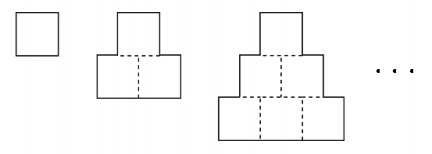

[15894_수학은_체육과목_입니다](https://www.acmicpc.net/problem/15894)  
===========
### 문제  

--------------
"한 변의 길이가 1인 정사각형을 아래 그림과 같이 겹치지 않게 빈틈없이 계속 붙여 나간다. 가장 아랫부분의 정사각형이 n개가 되었을 때, 실선으로 이루어진 도형의 둘레의 길이를 구하시오."  


### 입력  

--------------
첫 번째 줄에 가장 아랫부분의 정사각형 개수 n이 주어진다. (1 ≤ n ≤ 10^9)  
  
### 출력  

--------------
첫 번째 줄에 답을 출력  
  
> 입력 예시  
```
3
```  
> 출력 예시  
```
12
```

### 알고리즘 분류  
  
--------------
- 수학  

### 풀이  
  
--------------
도형의 아래쪽 변의 길이가 n이므로  
한 변의 길이가 n인 정사각형의 둘레 길이 출력  
  
### note  

--------------
